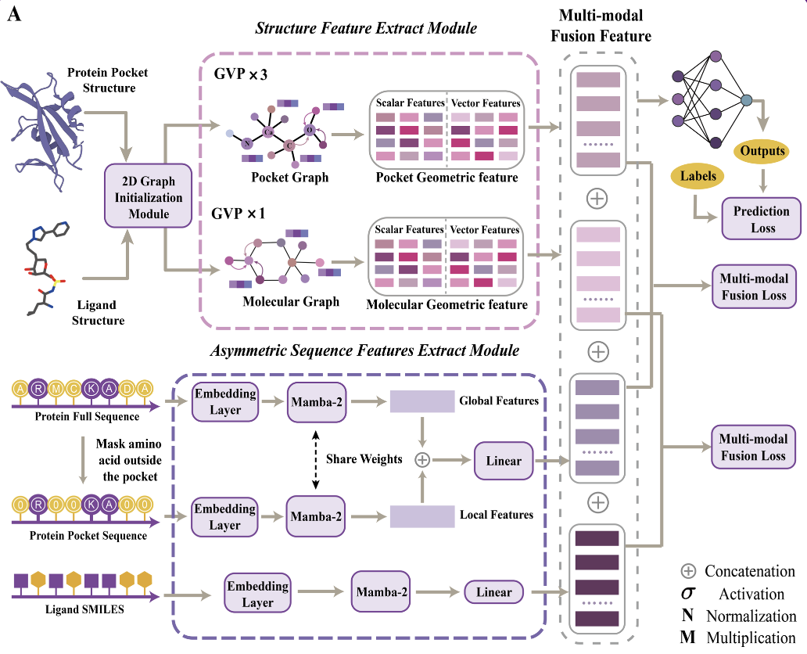
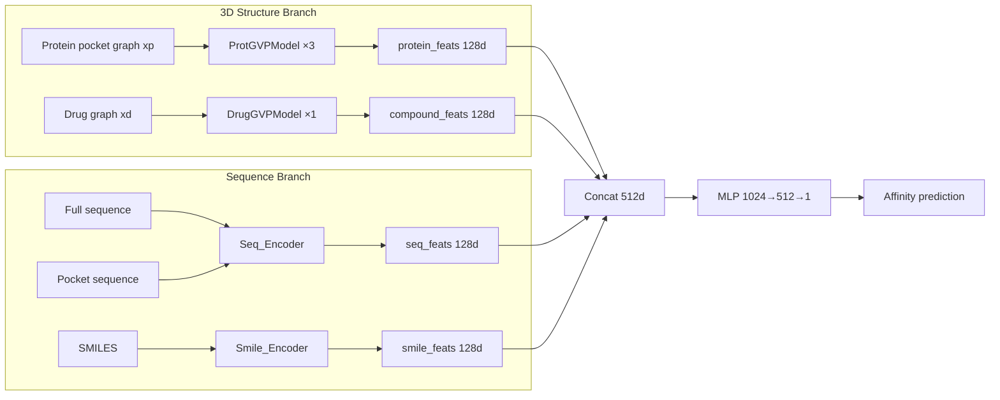
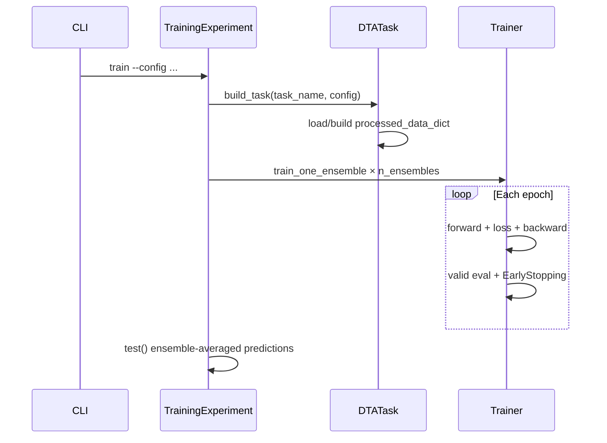
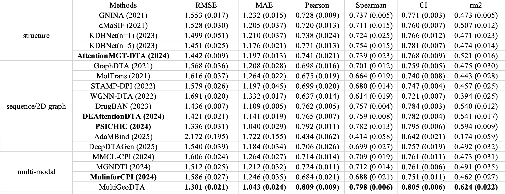
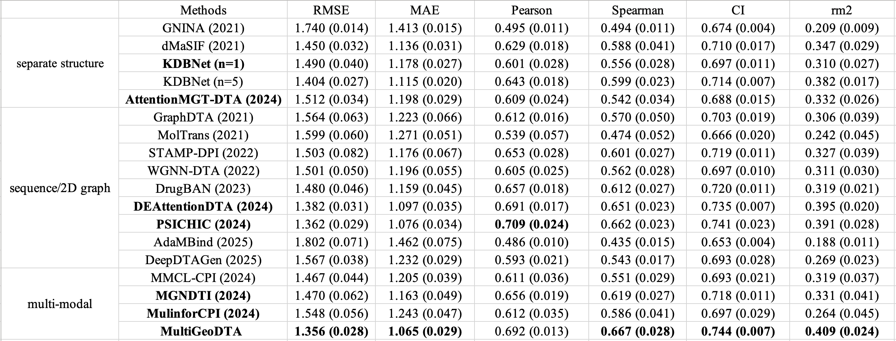

# MultiGeo-DTA Technical Documentation

> **Multi-modal Geometric Deep Learning Enables Drug-Target Affinity Prediction with Robustness and Generalization**
>
> Version 1.0.0 · Author Yazi Li · Contact yazi_li@tongji.edu.cn

---

## Table of Contents

1. [Project Overview](#project-overview)
2. [Model Architecture](#model-architecture)
3. [Environment Setup](#environment-setup)
4. [Data Preparation](#data-preparation)
5. [Configuration System](#configuration-system)
6. [Command-Line Interface](#command-line-interface)
7. [Training and Evaluation](#training-and-evaluation)
8. [Benchmark Tasks](#benchmark-tasks)
9. [Robustness Benchmark](#robustness-benchmark)
10. [Virtual Screening](#virtual-screening)
11. [Output Files](#output-files)
12. [Evaluation Metrics](#evaluation-metrics)
13. [Project Layout](#project-layout)
14. [FAQ](#faq)
15. [Citation and Contact](#citation-and-contact)

---

## Project Overview

MultiGeo-DTA is a **multimodal geometric deep learning** framework for predicting drug-target binding affinity (Drug-Target Affinity, DTA). The model jointly uses five types of information:

| Modality | Input Form | Encoder |
|----------|------------|---------|
| Protein pocket 3D structure | PyG graph (scalar + vector node/edge features) | ProtGVPModel (3 GVP layers) |
| Drug 3D structure | PyG graph | DrugGVPModel (1 GVP layer) |
| Full protein sequence | Amino-acid character sequence | Seq_Encoder (Conv + Mamba2) |
| Protein pocket sequence | Pocket residues kept, others masked as `<MASK>` | Seq_Encoder local branch |
| Drug SMILES | SMILES character sequence | Smile_Encoder (Conv + Mamba2) |

Four 128-dimensional graph-level or sequence-level features are concatenated and passed through an MLP to regress pKd/pKi affinity values. Training uses a **5-model ensemble** with alignment losses between structure and sequence modalities to improve generalization and robustness.

**Key features:**

- Dual-path fusion of structure (GVP) and sequence (Mamba2)
- Unified CLI: `train` / `evaluate` / `screen`
- Standard benchmarks: PDBBind v2016/v2020/v2021, LP-PDBBind, and more
- Built-in robustness tests under data degradation (missing samples, label noise)
- ZINC virtual screening pipeline



---

## Model Architecture

### Overall Data Flow



### Key Modules

**GVP (Geometric Vector Perceptron)** — implemented in `src/multigeodta/models/gvp.py`, adapted from [drorlab/gvp-pytorch](https://github.com/drorlab/gvp-pytorch). Processes both scalar features and 3D vector features for message passing on protein/ligand geometric graphs.

**ProtGVPModel / DrugGVPModel** — apply GVP convolutions on PyG batch graphs; `pyg_split` reshapes node features to `[batch, max_nodes, feat]`, then `DTAModel.forward` mean-pools over nodes to obtain graph-level vectors.

**Seq_Encoder** — multi-scale 1D convolutional embedding (kernels 1/3/5/7) plus two Mamba2 branches (global full sequence + local pocket sequence), outputting 128 dimensions.

**Smile_Encoder** — Conv + Mamba2 structure similar to Seq_Encoder, with vocabulary size 86.

### Default Tensor Dimensions

| Component | Node Input | Node Hidden | Edge Input | Edge Hidden |
|-----------|------------|-------------|------------|-------------|
| Protein GVP | [6, 3] | [128, 64] | [32, 1] | [32, 1] |
| Drug GVP | [86, 1] | [128, 64] | [24, 3] | [32, 1] |

- Protein scalar nodes: 6-dimensional dihedral angles (`pdb_graph.py`)
- Protein edges: RBF(16) + positional embedding(16) = 32 dimensions
- Drug scalar nodes: RDKit atom one-hot + continuous features, ~86 dimensions

### Fusion MLP

```
combined = concat(protein_feats, seq_feats, compound_feats, smile_feats)  # 512-d
MLP: [512] + mlp_dims + [1]   # default [1024, 512, 1], dropout=0.25
```

### Loss Function

The training objective is MSE regression loss with additional modality alignment terms:

```
L = MSE(y_pred, y) + 10 × MSE(protein_feats, seq_feats) + 10 × MSE(compound_feats, smile_feats)
```

Structure-branch features are aligned with their corresponding sequence-branch features to encourage consistent 3D and 1D representations.

### Ensemble Strategy

By default, `n_ensembles=5` independent models are trained (different random initializations). At test time, predictions from all 5 models are **averaged arithmetically** as the final ensemble result.

---

## Environment Setup

### System Requirements

| Item | Requirement |
|------|-------------|
| Python | 3.8 (`>=3.8,<3.9`, see `pyproject.toml`) |
| CUDA | 11.8 (recommended) |
| PyTorch | 2.1.0 + cu118 |
| GPU memory | ≥ 16 GB recommended (batch_size=128) |

### One-Command Install (Recommended)

```bash
cd /path/to/MultiGeoDTA
bash scripts/install.sh
conda activate multigeodta
export MULTIGEODTA_DATA_DIR=/path/to/MultiGeoDTA/data
```

`scripts/install.sh` creates the conda environment `multigeodta` and installs dependencies in order:

1. PyTorch 2.1.0 + CUDA 11.8
2. `requirements/base.txt`, RDKit, PyTorch Geometric
3. torch-scatter / sparse / cluster / spline-conv (cu118 prebuilt wheels)
4. DGL (torch 2.1 / cu118)
5. causal-conv1d and mamba-ssm prebuilt wheels
6. `pip install -e .` to install the multigeodta package

### Environment Variables (Install-Related)

| Variable | Description |
|----------|-------------|
| `GITHUB_RELEASE_MIRROR` | GitHub Release mirror (speeds up wheel downloads) |
| `CAUSAL_WHEEL_URL` | Custom causal-conv1d wheel URL |
| `MAMBA_WHEEL_URL` | Custom mamba-ssm wheel URL |
| `SKIP_CUDATOOLKIT` | Skip cudatoolkit installation |

### Smoke Test

Verify installation and a minimal training run:

```bash
bash scripts/smoke_install_and_train.sh
```

Equivalent to: install dependencies → download minimal pdbbind_v2016 data → quick train with `--smoke --n_epochs 1 --n_ensembles 1`.

### Other CUDA Versions

If cu118 is unavailable, pick matching wheels from:

- https://github.com/state-spaces/mamba/releases
- https://github.com/Dao-AILab/causal-conv1d/releases

---

## Data Preparation

### Download from Hugging Face (Recommended)

Preprocessed datasets and pretrained weights are hosted at [laddymo/MultiGeoDTA](https://huggingface.co/datasets/laddymo/MultiGeoDTA):

```bash
# Optional mirror for regions with slow Hugging Face access
export HF_ENDPOINT=https://hf-mirror.com

bash scripts/download_datasets_and_model_weights.sh
export MULTIGEODTA_DATA_DIR=/path/to/MultiGeoDTA/data
```

The script downloads data to `$MULTIGEODTA_DATA_DIR` (default: `project_root/data`).

### Dataset Overview

| Task | Data Directory | Main Files |
|------|----------------|------------|
| pdbbind_v2016 | `data/pdbbind_v2016/` | `last_{train,valid,test}_2016.csv`, `pocket/mol_structures_{split}.pkl.gz` |
| pdbbind_v2020 | `data/pdbbind_v2020/` | `last_*_2020.csv`, structure pkl |
| pdbbind_v2021_time | `data/pdbbind_v2021_time/` | `train/valid/test_2021.csv` |
| pdbbind_v2021_similarity | `data/pdbbind_v2021_similarity/{setting}/` | `train_{thre}.csv`, structure pkl |
| lp_pdbbind | `data/lp_pdbbind/` | `LP_PDBBind_{split}.csv` |
| zinc (virtual screening) | `data/zinc/` | `processed_zinc_*.csv`, `pocket/mol_structures.pkl.gz` |
| robustness | `data/pdbbind_v2016/pdbbind_v2016_robustness_test/` | perturbed training CSVs |

### Per-Sample Fields

Each training/test sample contains:

| Field | Type | Description |
|-------|------|-------------|
| `drug_graph` | PyG Data | Drug 3D graph |
| `protein_graph` | PyG Data | Protein pocket 3D graph |
| `full_sequence` | Tensor | Full protein sequence (integer encoding) |
| `pocket_sequence` | Tensor | Non-pocket positions set to `<MASK>` (0) |
| `smile_sequence` | Tensor | SMILES character encoding |
| `y` | float | Binding affinity label |
| `smile` | str | Original SMILES |
| `pdb_name` | str | PDB complex ID |

### First Run and Caching

On the first training run for a split, the pipeline will:

1. Read CSV files and `pocket/mol_structures_*.pkl.gz`
2. Call `pdb_to_graphs` / `sdf_to_graphs` to build graph features
3. Cache processed results as `processed_data_dict_{split}.pkl.gz`

**Initial featurization can take a long time**; subsequent runs load from cache.

### Graph Featurization Details

**Protein graph** (`src/multigeodta/data/featurizers/pdb_graph.py`):

- Nodes: 6-dimensional dihedral scalars + 3×3 vectors
- Edges: radius graph (`contact_cutoff`, default 8.0 Å) + kNN(k=3)
- Edge features: RBF distance encoding + positional embedding

**Drug graph** (`src/multigeodta/data/featurizers/mol_graph.py`):

- Nodes: RDKit atom features (~86-d scalars + coordinate vectors)
- Edges: chemical bonds + features

---

## Configuration System

Configuration uses **layered merging**: `configs/base.yaml` → task YAML → CLI arguments (later layers override earlier ones).

### Global Defaults (base.yaml)

| Parameter | Default | Description |
|-----------|---------|-------------|
| `task` | `pdbbind_v2016` | Task name |
| `seed` | 42 | Random seed |
| `contact_cutoff` | 8.0 | Protein contact graph cutoff (Å) |
| `num_rbf` | 16 | Number of RBF basis functions |
| `mlp_dims` | [1024, 512] | MLP hidden dimensions |
| `mlp_dropout` | 0.25 | MLP dropout |
| `n_ensembles` | 5 | Number of ensemble models |
| `batch_size` | 128 | Batch size |
| `n_epochs` | 100 | Maximum epochs |
| `patience` | 20 | Early stopping patience |
| `eval_freq` | 1 | Validation frequency (every N epochs) |
| `lr` | 0.0001 | Adam learning rate |
| `monitor_metric` | `mse` | Early stopping metric (lower is better) |
| `parallel` | false | joblib parallel ensemble training |
| `device` | 0 | CUDA device ID |
| `output_dir` | `outputs` | Output root directory |
| `save_log` | true | Write exp.log |
| `save_checkpoint` | true | Save checkpoint_{i}.pt |
| `save_prediction` | true | Save prediction.tsv |

### Task-Specific YAML

Located under `configs/tasks/`, typically overriding only `task` and `output_dir`:

| File | task | output_dir |
|------|------|------------|
| `pdbbind_v2016.yaml` | pdbbind_v2016 | outputs/pdbbind_v2016 |
| `pdbbind_v2020.yaml` | pdbbind_v2020 | outputs/pdbbind_v2020 |
| `pdbbind_v2021_time.yaml` | pdbbind_v2021_time | outputs/pdbbind_v2021_time |
| `pdbbind_v2021_similarity.yaml` | pdbbind_v2021_similarity | outputs/.../new_new/0.5 |
| `lp_pdbbind.yaml` | lp_pdbbind | outputs/lp_pdbbind |
| `zinc_vs.yaml` | zinc | outputs/zinc |
| `pdbbind_v2016_robustness/*.yaml` | pdbbind_v2016_robustness | outputs/pdbbind_v2016_robustness/{variant} |

### Environment Variables

| Variable | Default | Description |
|----------|---------|-------------|
| `MULTIGEODTA_DATA_DIR` | `./data` | Dataset root directory |
| `MULTIGEODTA_OUTPUT_DIR` | `./outputs` | Checkpoint and log root directory |

---

## Command-Line Interface

Entry point: `python -m multigeodta` or `multigeodta` (after installation).

### Subcommands

| Subcommand | Function |
|------------|----------|
| `train` | Train n_ensembles models and ensemble-evaluate on the test set |
| `evaluate` | Load saved checkpoints and evaluate |
| `screen` | ZINC virtual screening (default task=zinc) |

### All CLI Arguments

| Argument | Type | Description |
|----------|------|-------------|
| `--config` | str | YAML config file (overrides base.yaml) |
| `--task` | str | Task name |
| `--split_method` | choice | v2021 similarity: `new_compound` / `new_protein` / `new_new` |
| `--thre` | choice | Similarity Tanimoto threshold: 0.3 / 0.4 / 0.5 / 0.6 |
| `--variant` | str | Robustness variant name (e.g. `noised_scale_0.4`) |
| `--seed` | int | Random seed |
| `--contact_cutoff` | float | Protein graph cutoff |
| `--num_rbf` | int | RBF basis count |
| `--mlp_dims` | int+ | MLP hidden layers (space-separated integers) |
| `--mlp_dropout` | float | MLP dropout |
| `--n_ensembles` | int | Ensemble size |
| `--batch_size` | int | Batch size |
| `--n_epochs` | int | Maximum epochs |
| `--patience` | int | Early stopping patience |
| `--eval_freq` | int | Validation frequency |
| `--lr` | float | Learning rate |
| `--monitor_metric` | str | Early stopping metric |
| `--parallel` | flag | Parallel training of ensemble members |
| `--device` | int | GPU ID |
| `--output_dir` | str | Output directory |
| `--model_file` | str | Checkpoint subdirectory name (required for evaluate/screen) |
| `--data_dir` | str | Override MULTIGEODTA_DATA_DIR |
| `--smoke` | flag | Use only 8 samples per split (quick test) |
| `--save_log` / `--no_save_log` | | Control exp.log |
| `--save_checkpoint` / `--no_save_checkpoint` | | Control checkpoint saving |
| `--save_prediction` / `--no_save_prediction` | | Control prediction.tsv |

### Legacy Entry Points (Backward Compatible)

| File | Maps To |
|------|---------|
| `run_MultiGeoDTA.py` | `multigeodta train` |
| `test_MultiGeoDTA.py` | `multigeodta evaluate` |
| `run_vs.py` | `multigeodta screen` |

---

## Training and Evaluation

### Training Flow



### Basic Training Command

```bash
python -m multigeodta train --config configs/tasks/pdbbind_v2016.yaml
```

### Evaluate a Trained Model

`--model_file` is the subdirectory name under `MULTIGEODTA_OUTPUT_DIR` (not a single `.pt` file):

```bash
python -m multigeodta evaluate \
  --config configs/tasks/pdbbind_v2016.yaml \
  --model_file pdbbind_v2016 \
  --output_dir outputs/pdbbind_v2016
```

Evaluation loads `checkpoint_1.pt` … `checkpoint_N.pt` and writes per-model and ensemble metrics to `all_model_metrics.tsv`.

### Quick Smoke Test

```bash
python -m multigeodta train --task pdbbind_v2016 \
  --smoke --n_epochs 1 --n_ensembles 1 --batch_size 4 \
  --output_dir outputs/smoke_test
```

---

## Benchmark Tasks

### Gold Standard Results

#### PDBBind v2016



```bash
python -m multigeodta train --config configs/tasks/pdbbind_v2016.yaml
python -m multigeodta evaluate --config configs/tasks/pdbbind_v2016.yaml \
  --model_file pdbbind_v2016 --output_dir outputs/pdbbind_v2016
```

#### PDBBind v2020



```bash
python -m multigeodta train --config configs/tasks/pdbbind_v2020.yaml
python -m multigeodta evaluate --config configs/tasks/pdbbind_v2020.yaml \
  --model_file pdbbind_v2020 --output_dir outputs/pdbbind_v2020
```

### PDBBind v2021 (Similarity Split)

Ligand/protein novelty splits with three settings and four Tanimoto thresholds:

| split_method | Meaning |
|--------------|---------|
| `new_compound` | Test ligands not seen in training |
| `new_protein` | Test proteins not seen in training |
| `new_new` | Both ligand and protein are novel |

| thre | Tanimoto similarity threshold |
|------|-------------------------------|
| 0.3 / 0.4 / 0.5 / 0.6 | Increasing split strictness |

```bash
# Default: new_new / 0.5
python -m multigeodta train --config configs/tasks/pdbbind_v2021_similarity.yaml

# Custom split
python -m multigeodta train --task pdbbind_v2021_similarity \
  --split_method new_protein --thre 0.4 \
  --output_dir outputs/pdbbind_v2021_similarity/new_protein/0.4
```

### PDBBind v2021 (Time Split)

```bash
python -m multigeodta train --config configs/tasks/pdbbind_v2021_time.yaml
python -m multigeodta evaluate --config configs/tasks/pdbbind_v2021_time.yaml \
  --model_file pdbbind_v2021_time --output_dir outputs/pdbbind_v2021_time
```

### LP-PDBBind

```bash
python -m multigeodta train --config configs/tasks/lp_pdbbind.yaml
python -m multigeodta evaluate --config configs/tasks/lp_pdbbind.yaml \
  --model_file lp_pdbbind --output_dir outputs/lp_pdbbind
```

---

## Robustness Benchmark

Task name: `pdbbind_v2016_robustness`. Only the **training set** is perturbed; validation and test sets remain the standard PDBBind v2016 splits, so results are directly comparable to the main benchmark.

### Perturbation Types

| Type | Variants | Description |
|------|----------|-------------|
| Missing training samples | `missing_0.2` … `missing_0.8` | Randomly drop 20%–80% of training rows (from 3382 original) |
| Label noise | `noised_scale_0.2` … `noised_scale_1.0` | `label_new = label + scale × N(0,1)` |

### Configuration Files

Located under `configs/tasks/pdbbind_v2016_robustness/`, 9 YAML files in total.

### Run Examples

```bash
# Label noise scale=0.4
python -m multigeodta train \
  --config configs/tasks/pdbbind_v2016_robustness/noised_scale_0.4.yaml

# Drop 60% of training samples
python -m multigeodta train \
  --config configs/tasks/pdbbind_v2016_robustness/missing_0.6.yaml

# Specify variant via CLI
python -m multigeodta train --task pdbbind_v2016_robustness \
  --variant missing_0.6 \
  --output_dir outputs/pdbbind_v2016_robustness/missing_0.6

# Run all 9 variants
for cfg in configs/tasks/pdbbind_v2016_robustness/*.yaml; do
  python -m multigeodta train --config "$cfg"
done
```

See `data/pdbbind_v2016/pdbbind_v2016_robustness_test/README.md` for details.

---

## Virtual Screening

Rank compounds from the ZINC library by predicted affinity against a specified target (protein sequence + pocket residue positions).

### Basic Command

```bash
python -m multigeodta screen \
  --config configs/tasks/zinc_vs.yaml \
  --model_file pdbbind_v2020 \
  --output_dir outputs/zinc \
  --device 0
```

- Uses checkpoints trained on PDBBind v2020 by default
- Example target is CB1R (see the `target` block in `zinc_vs.yaml`)

### target Configuration

```yaml
target:
  protein_sequence: "..."      # Full amino-acid sequence
  pocket_positions: [10, 12, ...]  # 1-based pocket residue indices
```

### ZINC Data Preparation

```bash
bash scripts/build_zinc_vs_dataset.sh
```

Full workflow in `data/zinc/README.md` (download, filtering, structure preprocessing, new-target workflow).

### Molecular Docking Demo

`scripts/virtual_screening/docking/` provides format conversion and docking notebooks for joint analysis with prediction results.

### Screening Output

`prediction.tsv` columns: `zinc_id`, `SMILES`, `y_pred_avg`, `y_pred_1` … `y_pred_N` (candidates sorted by predicted affinity, descending).

---

## Output Files

After training/evaluation, typical files under `output_dir`:

| File | Description |
|------|-------------|
| `args.yaml` | Full run configuration snapshot |
| `exp.log` | Training log |
| `checkpoint_{1..N}.pt` | Weights for each ensemble model |
| `prediction.tsv` | Test predictions (y_true, y_pred_avg, y_pred_i) |
| `all_model_metrics.tsv` | Per-model + Mean/Std/Ensemble metrics (evaluate mode) |

Checkpoint path resolution: `{MULTIGEODTA_OUTPUT_DIR}/{model_file}/checkpoint_{i}.pt`.

---

## Evaluation Metrics

Implemented in `src/multigeodta/metrics/regression.py`:

| Metric | Function | Usage |
|--------|----------|-------|
| MSE | `eval_mse(squared=True)` | Training validation, early stopping |
| RMSE | `eval_mse(squared=False)` | Test reporting |
| MAE | `eval_mae` | Test reporting |
| Pearson | `eval_pearson` | Correlation |
| Spearman | `eval_spearman` | Rank correlation |
| CI | `concordance_index` | Concordance index (evaluate report) |
| rm² | `rm2` | Regression quality metric (evaluate report) |
| R² | `eval_r2` | Coefficient of determination |

Default training/validation monitoring: `mse`, `spearman`, `pearson`.  
`evaluate` mode additionally reports: `rmse`, `mae`, `spearman`, `pearson`, `ci`, `rm2`.

---

## Project Layout

```
MultiGeoDTA/
├── assets/                      # Architecture and benchmark figures
├── docs/                        # OpenDocs source (this file)
├── src/multigeodta/             # Installable Python package
│   ├── cli.py                   # Unified CLI
│   ├── config/                  # YAML loading
│   ├── data/                    # Datasets, featurizers, task registry
│   │   ├── featurizers/         # pdb_graph.py, mol_graph.py
│   │   └── tasks/               # registry.py, base.py, benchmarks
│   ├── models/                  # dta_model.py, gvp.py
│   ├── training/                # experiment.py, trainer.py
│   ├── inference/               # virtual_screen.py
│   ├── metrics/                 # regression.py
│   └── utils/                   # paths, logging
├── configs/
│   ├── base.yaml
│   └── tasks/                   # Per-benchmark YAML
├── scripts/
│   ├── install.sh
│   ├── download_datasets_and_model_weights.sh
│   ├── build_zinc_vs_dataset.sh
│   ├── dataset/                 # Raw PDBBind preprocessing
│   └── virtual_screening/docking/
├── requirements/                # base.txt, cuda118.txt
├── data/                        # Downloaded data (gitignored)
├── outputs/                     # Checkpoints (gitignored)
├── run_MultiGeoDTA.py           # Legacy shim
├── run_vs.py
├── test_MultiGeoDTA.py
├── pyproject.toml
└── environment.yml
```

### Task Registry

`build_task()` factory in `src/multigeodta/data/tasks/registry.py`:

| task name | Class |
|-----------|-------|
| pdbbind_v2016 | PDBbindV2016Task |
| pdbbind_v2016_robustness | PDBbindV2016RobustnessTask |
| pdbbind_v2020 | PDBbindV2020Task |
| pdbbind_v2021_time | PDBbindV2021TimeTask |
| pdbbind_v2021_similarity | PDBbindV2021SimilarityTask |
| lp_pdbbind | LPPDBbindTask |
| zinc | ZincVirtualScreenTask |

---

## FAQ

### Q1: Must Python be 3.8?

Yes. Dependencies such as `mamba-ssm` and `causal-conv1d` provide prebuilt wheels for Python 3.8 + CUDA 11.8; upgrading Python may cause installation failures.

### Q2: evaluate fails with checkpoint not found?

Confirm `--model_file` is a **subdirectory name** under `outputs/` (e.g. `pdbbind_v2016`) and that `checkpoint_1.pt` etc. exist there. Full path: `{MULTIGEODTA_OUTPUT_DIR}/{model_file}/checkpoint_{i}.pt`.

### Q3: First training run is very slow?

The first run builds 3D graph features and writes `processed_data_dict_*.pkl.gz` cache files. Subsequent epochs and reruns are much faster.

### Q4: Hugging Face download fails?

Check network and DNS. In regions with slow access, try `export HF_ENDPOINT=https://hf-mirror.com`. The script detects stale local_dir and prints error hints.

### Q5: How to run virtual screening on a new target?

1. Prepare target PDB/sequence and pocket residue indices
2. Follow `data/zinc/README.md` to build `processed_zinc_*.csv` and structure pkl
3. Set `target.protein_sequence` and `target.pocket_positions` in YAML
4. Run `multigeodta screen`

### Q6: How to reduce GPU memory usage?

Lower `--batch_size` (e.g. 32 or 64), or use `--smoke` for functional verification.

### Q7: Can I train only 1 model?

Yes: `--n_ensembles 1`. The default of 5 ensembles is for reproducing paper results.

---

## Citation and Contact

If you use this code in research, please cite the MultiGeo-DTA paper.

- **GitHub**: https://github.com/liyazi712/MultiGeo-DTA
- **Dataset**: https://huggingface.co/datasets/laddymo/MultiGeoDTA
- **Contact**: yazi_li@tongji.edu.cn or GitHub Issues

---
*Documentation version synced with code: multigeodta 1.0.0*
